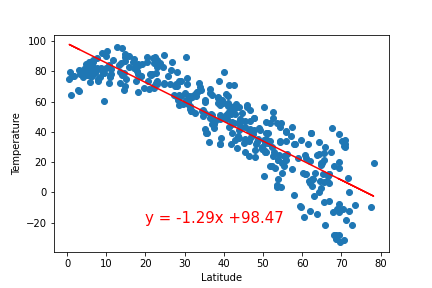

# Python APIs - What's the Weather Like?

## Background

Whether financial, political, or social -- data's true power lies in its ability to answer questions definitively. For the purpose of this project Python requests, APIs, and JSON traversals will be used to answer a fundamental question: "What's the weather like as we approach the equator?"

### Observations based on the analysis and graphs

## Part I - WeatherPy

In this project, a Python script is created to visualize the weather of 500+ cities across the world of varying distance from the equator. After all data was collected, a series of scatter plots were created to show if there is a relationship between different weather conditions and the cities latitude:

* Temperature (F) vs. Latitude
* Humidity (%) vs. Latitude
* Cloudiness (%) vs. Latitude
* Wind Speed (mph) vs. Latitude

The second analysis is a linear regression on each relationship but also, they are separated by Northern and Southern Hemisphere.

* Northern Hemisphere - Temperature (F) vs. Latitude
* Southern Hemisphere - Temperature (F) vs. Latitude
* Northern Hemisphere - Humidity (%) vs. Latitude
* Southern Hemisphere - Humidity (%) vs. Latitude
* Northern Hemisphere - Cloudiness (%) vs. Latitude
* Southern Hemisphere - Cloudiness (%) vs. Latitude
* Northern Hemisphere - Wind Speed (mph) vs. Latitude
* Southern Hemisphere - Wind Speed (mph) vs. Latitude

Based on the analysis there are some obvious relations - as we getting close to the equator the temperatures are raising and some observations that could be interesting enough to look at their graphs.
# Fig.1

 

The first figure shows the temperature in different latitudes and the second two graphs are showing the linear regression on the temperature vs latitude but split by Northern and Southern Hemisphere. It is obvious that the highest temperatures are around the equator and if we look at the second graph there is a strong correlation between temperature and latitude - going further North the temperatures are going down. Interestingly enough if we look at the third graph - the regression for the Southern Hemisphere, the correlation is there but it is not that strong as it was with Northern Hemisphere. The reason for that is the time of the year. As this survey is made in the beginning of the spring in the Northern Hemisphere and temperatures could range from close to a 100F to under -20F in the meantime in the Southern Hemisphere the weather is more moderate at this time of the year and there are no temperatures under 50F. Another aspect about this is that the data collected reflect on cities at both Hemispheres and North is more congested than the South so there are more cities involved in the analysis from the North.

Let's look at the humidity for both Northern and Southern Hemisphere below:

 

We can conclude that there is no strong relation between humidity and latitude in both Hemispheres. Interesting observation is that in the Northern Hemisphere the humidity is higher going further away from the equator and in the Southern Hemisphere is the opposite. Again, the reason for this is the time of the year where on the North the winter just finished going in spring and on the South was just the end of the summer going in fall.

Let's look at the wind speed vs latitude figure:

 

The figure above shows that there is no relation between the wind speed and the latitude. If we look at the right side of the graph, which represent the North we can see few outliers in the the range 30-40mph and respectively on the South looks little bit calmer which again could be connected with the seasons in the different parts of the world. It would be interesting to see if there is a significant difference in the fall season of Northern Hemisphere when the hurricanes season starts as well. 

### Part II - VacationPy

* Create a heat map that displays the humidity for every city from the part I.

  
  
* Narrow down the Data Frame to find your ideal weather condition. For example:

  * A max temperature lower than 80 degrees but higher than 70.

  * Wind speed less than 10 mph.

  * Zero cloudiness.
  
  There were only 12 hotels that met all the requirements and on the map below you can see their locations.

  

  Enjoy your travel!
